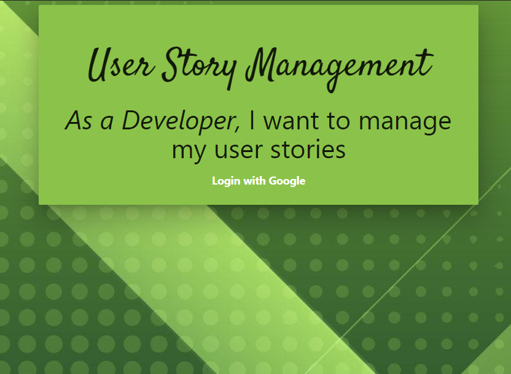

# User Story Management

## Techologies Used:
- HTML5
- CSS
- JavaScript
- Node.JS
- Express
- MongoDB
- Materialize CSS Framework

## Getting Started:

Use my full-stack application to manage your project user stories! 

[Use my application here](https://user-story-management.herokuapp.com/)

[Project's Trello Board](https://trello.com/b/QCVYewCI/project-2)

## Next Steps:

- Add a Developers model embedded within the stories model to allow assigning developers to a story
- Add notification of story status changes using an API
- Add a login method to not use Oauth and instead login using your own credientals.

